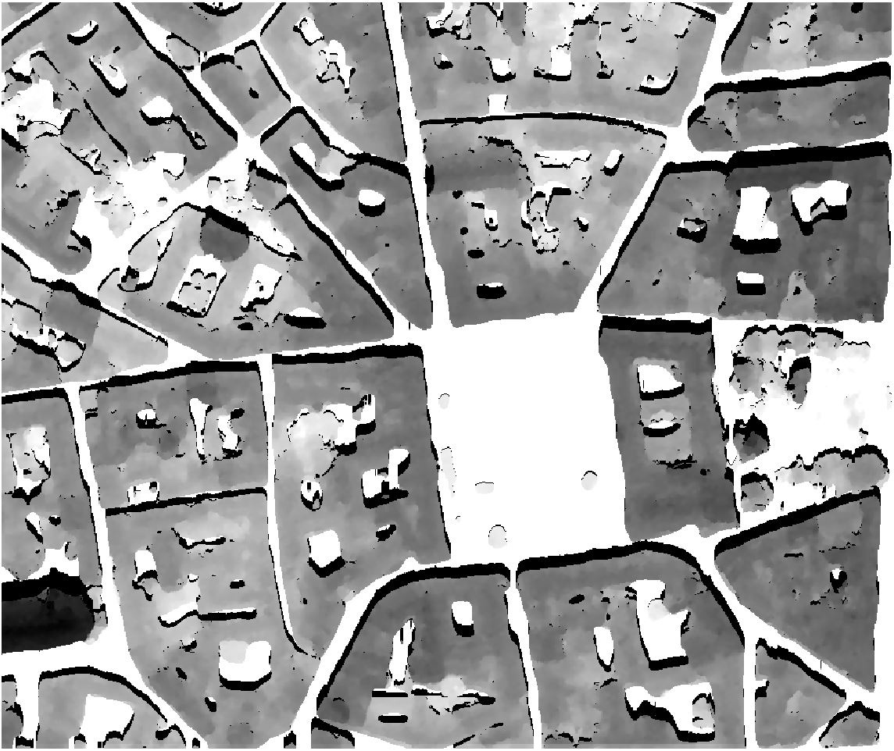

.. hillshade:

hillshade
---------

``hillshade`` (or ``hs``) subcommand computes the hillshades of a Digital Height Model.
The tool takes the sun position (elevation and azimuth) as input and
computes the shadows of the ground surface (buildings, trees, etc.).

.. code-block:: console

  $ georastertools hillshade --help
  usage: georastertools hillshade [-h] --elevation ELEVATION --azimuth AZIMUTH
                               [--radius RADIUS] --resolution RESOLUTION
                               [-o OUTPUT] [-ws WINDOW_SIZE]
                               [-p {none,edge,maximum,mean,median,minimum,reflect,symmetric,wrap}]
                               inputs [inputs ...]

  Execute the hillshade subcommand on a Digital Height Model (DHM) using the
  given solar parameters (elevation, azimuth), resolution, and optional
  parameters for processing the raster.

  Arguments:

      inputs TEXT

      Input file to process (i.e. geotiff corresponding to a Digital Height
      Model). You can provide a single file with extension ".lst" (e.g.
      "hillshade.lst") that lists the input files to process (one input file
      per line in .lst)

  Options:
      --elevation FLOAT               Elevation of the sun in degrees, [0°, 90°]
                                      where 90°=zenith and 0°=horizon  [required]
      --azimuth FLOAT                 Azimuth of the sun in degrees, [0°, 360°]
                                      where 0°=north, 90°=east, 180°=south and
                                      270°=west  [required]
      --radius INTEGER                Maximum distance (in pixels) around a point
                                      to evaluate horizontal elevation angle. If
                                      not set, it is automatically computed from
                                      the range of altitudes in the digital model.
      --resolution FLOAT              Pixel resolution in meter  [required]
      -o, --output TEXT               Output directory to store results (by
                                      default current directory)
      -ws, --window_size INTEGER      Size of tiles to distribute processing,
                                      default: 1024
      -p, --pad [none,edge,maximum,mean,median,minimum,reflect,symmetric,wrap]
                                      Pad to use around the image, default : edge (see
                                      https://numpy.org/doc/stable/reference/generated/numpy.pad.html
                                      for more information)
      -h, --help                      Show this message and exit.

.. warning::
  This command line does not accept all input raster products as other raster tools (radioindice, zonalstats).
  It is mandatory to use a raster file (typically a geotif) in a format that can be read by rasterio: rasterio.open(xxx)).

Example:

Let's take as input a Digital Height Model of Toulouse generated from a PLEIADES stereo (0.5m resolution):

.. image:: ../_static/dsm.jpg

The following commands will compute the hillshades of this Digital Height Model at 3 differents solar
hours (8:00AM, noon, 6:00PM) of 21st June:

.. code-block:: console

  $ georastertools hillshade --elevation 27.2 --azimuth 82.64 --resolution 0.5 toulouse-mnh.tif
  $ georastertools hillshade --elevation 69.83 --azimuth 180 --resolution 0.5 toulouse-mnh.tif
  $ georastertools hillshade --elevation 25.82 --azimuth 278.58 --resolution 0.5 toulouse-mnh.tif

The generated images are rendered with QGis:
- first layer contains the hillshade (value 0 is masked)
- second layer contains the Digital Height Model rendered in grayscale (white to black)

Here are the captures:

- 8 AM

.. image:: ../_static/dsm-hillshade1.jpg

- Noon

- 6 PM

.. image:: ../_static/dsm-hillshade3.jpg

