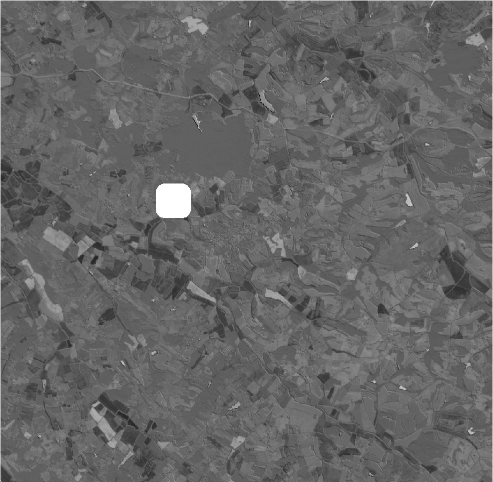

.. speed:

speed
-----

``speed`` (or ``sp``) computes the time derivative of the radiometry of a series of raster products of the same type.

.. code-block:: console

  $ rastertools speed --help
  usage: rastertools speed [-h] [-b BANDS [BANDS ...]] [-a] [-o OUTPUT]
                           inputs [inputs ...]

  Compute the speed of radiometric values for multiple raster images.

  This command calculates the speed of radiometric values for raster data,
  optionally processing specific bands or all bands from the input images. The
  results are saved to a specified output directory.

  Arguments:

      inputs TEXT

      Input file to process (e.g. Sentinel2 L2A MAJA from THEIA). You can
      provide a single file with extension ".lst" (e.g. "speed.lst") that
      lists the input files to process (one input file per line in .lst).

  Options:
      -b, --bands INTEGER  List of bands to process
      -a, --all            Process all bands
      -o, --output TEXT    Output directory to store results (by default current
                           directory)
      -h, --help           Show this message and exit.

.. warning::
  At least two input rasters must be given. The rasters must match one of the configured raster types,
  either a built-in raster type or a custom raster type defined with option -t of ``rastertools``.
  See section "Raster types".

Example:

.. code-block:: console

  $ rastertools speed ./SENTINEL2A_20180521-105702-711_L2A_T30TYP_D-ndvi.zip ./SENTINEL2B_20181023-105107-455_L2A_T30TYP_D-ndvi.tif

This command generates an image with one band that represents :math:`\\frac{ndvi_2 - ndvi_1}{date_2 - data_1}` where:

- index 1 corresponds to the first image in the command line: date_1=2018/05/21 10:57:02
- index 2 corresponds to the second image in the command line: date_2=2018/10/23 10:51:07

Here is a capture of the output image:

Notice the presence of a nodata zone that comes from the SENTINEL2B product which has a cloud mask.
