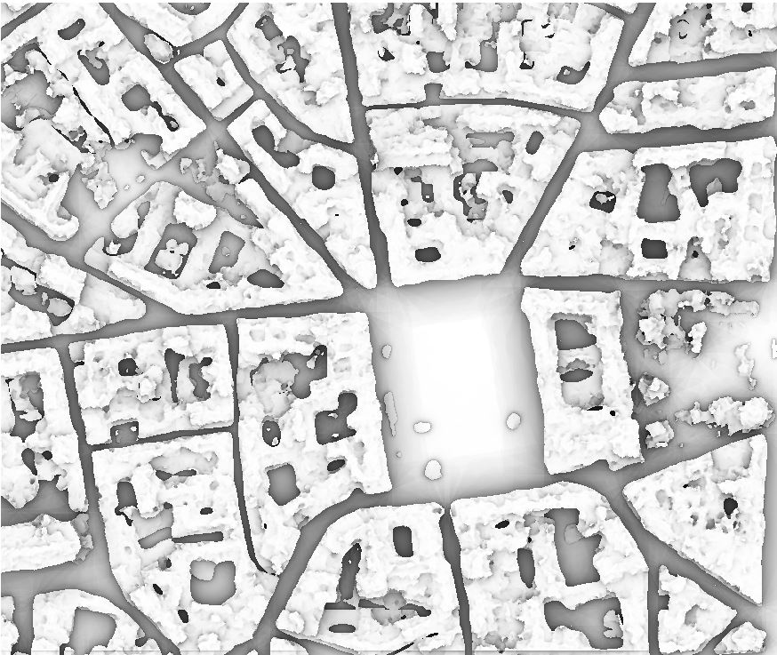
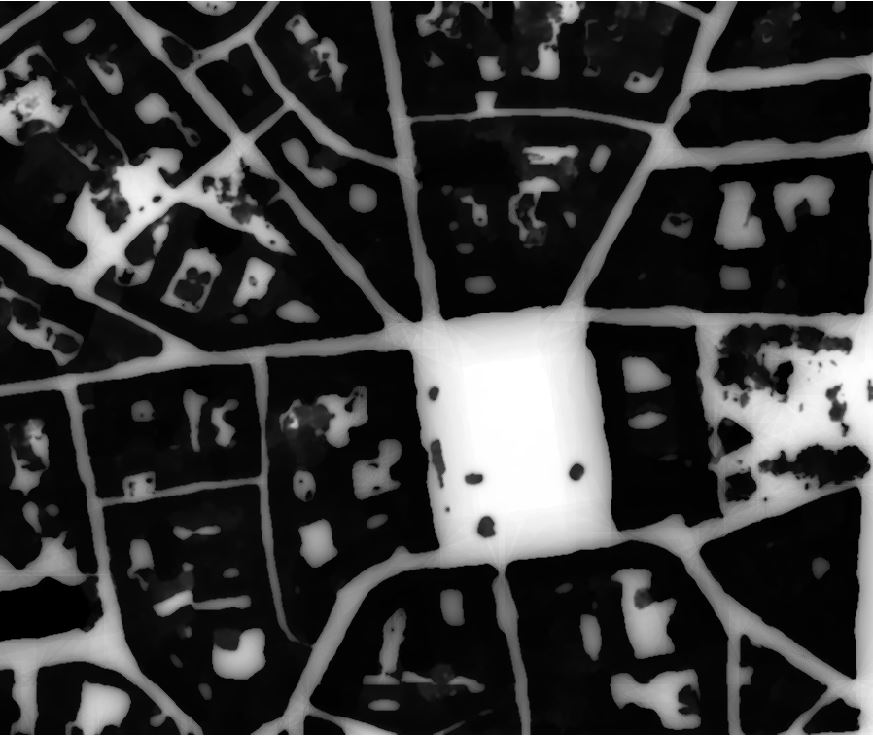

.. svf:

svf
---

``svf`` computes the SVF of a Digital Height Model.

SVF stands for Sky View Factor. It is a geophysical parameter that measures the portion of the sky
visible from a certain point. The portion of the sky visible above the surface is especially relevant
in energy balance studies and computation of diffuse solar insolation.

Sky-view factor is defined as the proportion of visible sky (:math:`\Omega`) above a certain
observation point as seen from a two-dimensional representation.

The light that falls from the sky onto a certain part of the surface is reduced by the obstacles
that form the horizon. These obstacles can be described in all directions by the vertical
elevation angle above the horizontal plane.

A good SVF approximation can therefore be performed with the estimate of this angle
in several directions. After the vertical elevation angle is determined in the chosen
number of directions n, the SVF is determined as a sum of all portions of the sky within
each direction: :math:`\sum \frac {\cos \gamma_i}{n}`, where :math:`\gamma_i` is the
vertical angle of the horizon in the`direction i.

The angle :math:`\gamma` is extracted from the Digital Elevation Model:
:math:`\tan \frac{Height}{Distance}`::

                          _____
                        x|     |  ^
                    x    |     |  | Height (from Digital Elevation Model)
               x   __    |     |  |
      ____p_______|  |___|     |__v____________
          <-------------->
              Distance

Where p is the current pixel where the SVF is computed.

In a direction, the algorithm computes all angles and keeps the largest one. To avoid testing
too many points, the "radius" parameter defines the max distance of the pixel to test.

.. code-block:: console

  $ georastertools svf --help
  usage: georastertools svf [-h] --radius RADIUS --directions DIRECTIONS
                         --resolution RESOLUTION [--altitude ALTITUDE]
                         [-o OUTPUT] [-ws WINDOW_SIZE]
                         [-p {none,edge,maximum,mean,median,minimum,reflect,symmetric,wrap}]
                         inputs [inputs ...]

  Compute the Sky View Factor (SVF) of a Digital Height Model (DHM).

  The Sky View Factor (SVF) is a measure of the visibility of the sky from a
  point in a Digital Height Model (DHM). It is calculated by evaluating the
  horizontal elevation angle from a given point in multiple directions (as
  specified by the user), and is influenced by the topography and surrounding
  terrain features.

  Arguments:

      inputs TEXT

      Input file to process (i.e. geotiff corresponding to a Digital Height
      Model). You can provide a single file with extension ".lst" (e.g.
      "svf.lst") that lists the input files to process (one input file
      per line in .lst)

  Options:
      --radius INTEGER                Maximum distance (in pixels) around a point
                                      to evaluate horizontal elevation angle
                                      [required]
      --directions INTEGER            Number of directions on which to compute the
                                      horizon elevation angle  [required]
      --resolution FLOAT              Pixel resolution in meter  [required]
      --altitude INTEGER              Reference altitude to use for computing the
                                      SVF. If this option is not specified, SVF is
                                      computed for every point at the altitude of
                                      the point
      -o, --output TEXT               Output directory to store results (by
                                      default current directory)
      -ws, --window_size INTEGER      Size of tiles to distribute processing,
                                      default: 1024
      -p, --pad [none,edge,maximum,mean,median,minimum,reflect,symmetric,wrap]
                                      Pad to use around the image, default : edge(see
                                      https://numpy.org/doc/stable/reference/generated/numpy.pad.html
                                      for more information)
      -h, --help                      Show this message and exit.

.. warning::
  This command line does not accept all input raster products as other raster tools (radioindice, zonalstats).
  It is mandatory to use a raster file (typically a geotif) in a format that can be read by rasterio: rasterio.open(xxx)).

Example:

Let's take as input a Digital Height Model of Toulouse generated from a PLEIADES stereo (0.5m resolution):

.. image:: ../_static/dsm.jpg

The first command line computes the Sky View Factor using 16 directions and a radius of 50 pixels (25 meters).
The SVF is computed at the altitude of every point of the Digital Height Model, i.e. the SVF is computed on top
of buildings (for the highest building, SVF is thus 1).

.. code-block:: console

  $ georastertools svf --radius 50 --directions 16 --resolution 0.5 tests\tests_data\toulouse-mnh.tif

This command generates the following SVF:

It is also possible to compute the SVF at a specified height, for instance on ground (0m altitude for a Digital Height Model).

.. code-block:: console

  $ georastertools svf --radius 50 --directions 16 --resolution 0.5 tests\tests_data\toulouse-mnh.tif

The SVF is the following:

As expected, the SVF at altitude 0m are equal to 0 for pixels inside buildings, and are the same as in the previous image
for pixels outside the buildings.