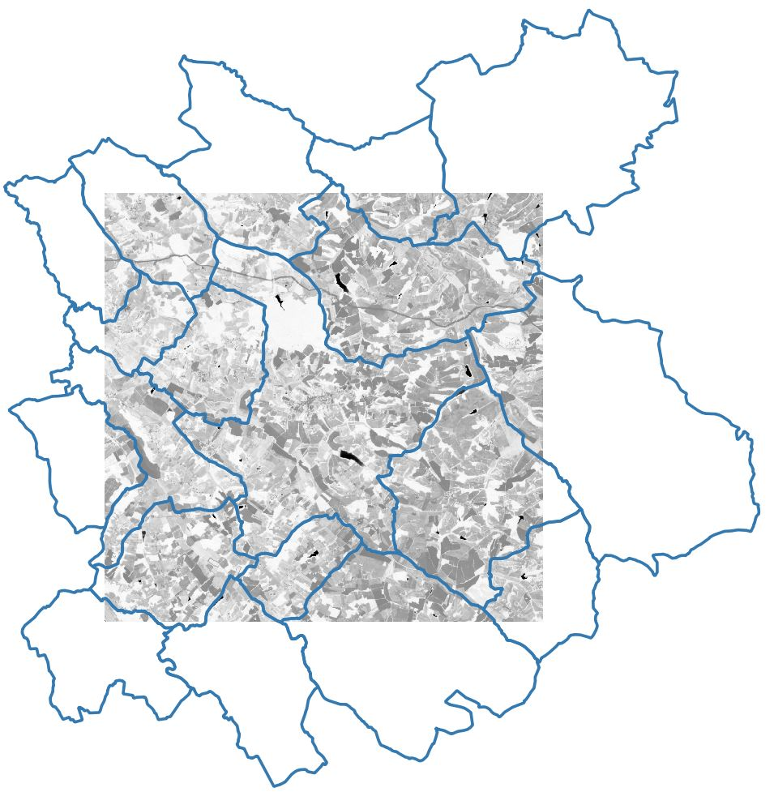
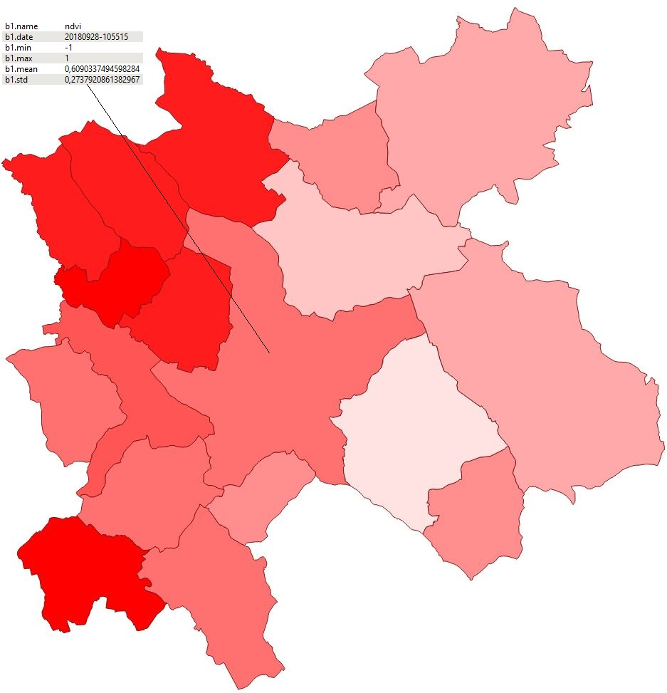
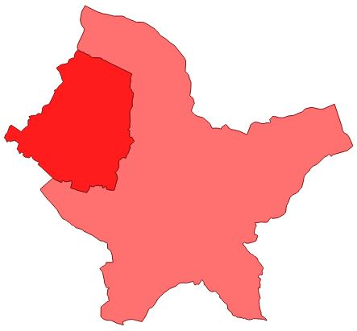

.. zonalstats:

zonalstats
----------

``zonalstats`` (or ``zs``) computes zonal statistics of an input raster. The zones are defined by 
a vector file (shapefile, geojson, etc.). If no vector file is provided, the statistics are 
computed on the whole image.

Statistics inside a geometry can be computed for different categories also defined by a vector
file. For instance, it is possible to compute the average height of buildings and vegetation of
cities using:

- a Digital Height Model (input raster file)
- a shapefile with the boundaries of cities (-g argument)
- a shapefile with the buildings / vegetation classification (--category_file)

.. code-block:: console

  $ rastertools zonalstats --help
  usage: rastertools zonalstats [-h] [-o OUTPUT] [-f OUTPUT_FORMAT]
                                [-g GEOMETRIES] [-w] [--stats STATS [STATS ...]]
                                [--categorical]
                                [--valid_threshold VALID_THRESHOLD] [--area]
                                [--prefix PREFIX] [-b BANDS [BANDS ...]] [-a]
                                [--sigma SIGMA] [-c CHARTFILE] [-d]
                                [-gi GEOM_INDEX] [--category_file CATEGORY_FILE]
                                [--category_index CATEGORY_INDEX]
                                [--category_names CATEGORY_NAMES]
                                inputs [inputs ...]
  
  Compute zonal statistics of a raster image. Available statistics are: min max
  range mean std percentile_x (x in [0, 100]) median mad count valid nodata sum
  majority minority unique
  
  positional arguments:
    inputs                Raster files to process. You can provide a single file
                          with extension ".lst" (e.g. "zonalstats.lst") that
                          lists the input files to process (one input file per
                          line in .lst)
  
  optional arguments:
    -h, --help            show this help message and exit
    -o OUTPUT, --output OUTPUT
                          Output dir where to store results (by default current
                          dir)
    -f OUTPUT_FORMAT, --format OUTPUT_FORMAT
                          Output format of the results when input geometries are
                          provided (by default ESRI Shapefile). Possible values
                          are ESRI Shapefile, GeoJSON, CSV, GPKG, GML
    -g GEOMETRIES, --geometry GEOMETRIES
                          List of geometries where to compute statistics (vector
                          like a shapefile or geojson)
    -w, --within          When activated, statistics are computed for the
                          geometries that are within the raster shape. The
                          default behaviour otherwise is to compute statistics
                          for all geometries that intersect the raster shape.
    --stats STATS [STATS ...]
                          List of stats to compute. Possible stats are: min max
                          range mean std percentile_x (x in [0, 100]) median mad
                          count valid nodata sum majority minority unique
    --categorical         If the input raster is categorical (i.e. raster values
                          represent discrete classes) compute the counts of
                          every unique pixel values.
    --valid_threshold VALID_THRESHOLD
                          Minimum percentage of valid pixels in a shape to
                          compute its statistics.
    --area                Whether to multiply all stats by the area of a cell of
                          the input raster.
    --prefix PREFIX       Add a prefix to the keys (default: None). One prefix
                          per band (e.g. 'band1 band2')
    -b BANDS [BANDS ...], --bands BANDS [BANDS ...]
                          List of bands to compute
    -a, --all             Compute all bands
  
  Options to output the outliers:
    --sigma SIGMA         Distance to the mean value (in sigma) in order to
                          produce a raster that highlights outliers.
  
  Options to plot the generated stats:
    -c CHARTFILE, --chart CHARTFILE
                          Generate a chart per stat and per geometry
                          (x=timestamp of the input products / y=stat value) and
                          store it in the file defined by this argument
    -d, --display         Display the chart
    -gi GEOM_INDEX, --geometry-index GEOM_INDEX
                          Name of the geometry index used for the chart
                          (default='ID')
  
  Options to compute stats per category in geometry. If activated, the generated geometries will contain stats for every categories present in the geometry:
    --category_file CATEGORY_FILE
                          File (raster or geometries) containing discrete
                          classes classifying the ROI.
    --category_index CATEGORY_INDEX
                          Column name identifying categories in categroy_file
                          (only if file format is geometries)
    --category_names CATEGORY_NAMES
                          JSON files containing a dict with classes index as
                          keys and names to display classes as values.
  
  By default only first band is computed.

When -g option is set with a valid geometries file, ``zonalstats`` generate a new vector file with the following metadata:

- [prefix].name : name of the band (if available in the input raster)
- [prefix].date : date of the input raster (if the raster has one of the configured raster types, either a built-in raster
  type or an additional custom raster type)
- [prefix].[stat] : values of the statistics
- [prefix].[pixel] : count of pixels having value = [pixel] when the categorical option is activated
- [prefix].[category][stat] : values of the statistics for the category [category] when the category_names option is activated.

With :

- [prefix] : prefix defined in the command line. If not set in the command line: b[band_number]
- [stat] : name of the statistics, e.g. mean, std

If no vector file is set in the command line, the statistics are stored in a new vector file that contains a single entry
whose geometry is the raster shape (without the zones of nodata).

Examples:

The following examples use an input raster file generated by radioindice. This is an NDVI of a SENTINEL2 L2A THEIA image that
covers most of the cities we are interested in.

The first command generates statistics of ndvi values for several cities

.. code-block:: console

  $ rastertools zs -f GeoJSON -g COMMUNE_32.geojson --stats min max mean std SENTINEL2A_20180928-105515-685_L2A_T30TYP_D-ndvi.tif

This generates a new vector file that contains for each entity the stats values.

Notice that some cities are partially covered by the input raster and their statistics are thus probably not fully relevant.
To disable the computation for these cities, use option --within.

.. code-block:: console

  $ rastertools zs -f GeoJSON -g COMMUNE_32.geojson --within --stats min max mean std SENTINEL2A_20180928-105515-685_L2A_T30TYP_D-ndvi.tif

The new vector file is now:

Let's use another raster file that corresponds to a land cover map named OSO. In this map, every pixel has
a value that represents its class (for instance: 1=dense urban area).

The following command line enables to count the pixels of every classes:

.. code-block:: console

  $ rastertools zs -f GeoJSON --categorical OCS_2017_CESBIO.tif

The generated vector file contains one geometry (a green square that corresponds to the shape of the
input raster) with the number of pixels for each category:

.. image:: ../_static/oso-stats.jpg
